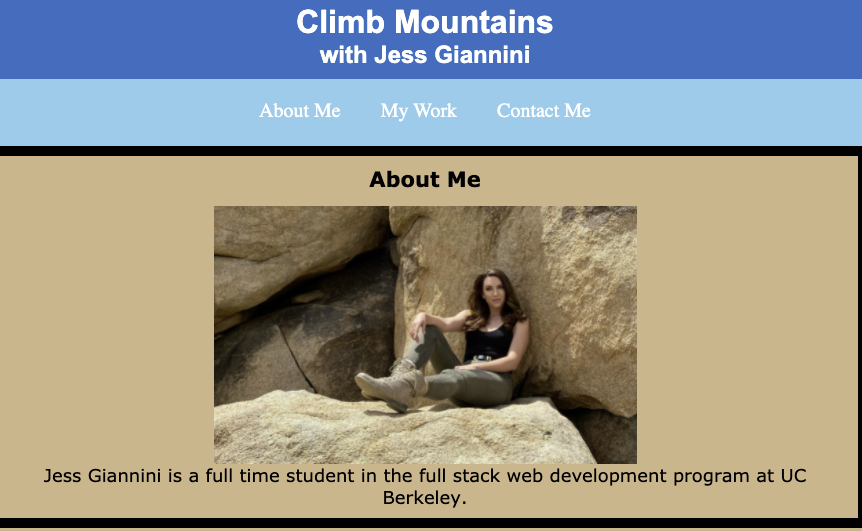

## Web Developer Portfolio

## Getting Started

This project was prepared using html and css using Visual Studio Code editor. The website should appear as seen below.

## Built With

- [HTML](https://developer.mozilla.org/en-US/docs/Web/HTML)
- [CSS](https://developer.mozilla.org/en-US/docs/Web/CSS)
- [Coming Soon](JavaScript and Bootstrap)

## Deployed Link

[Click Here for Live Site](https://github.com/JessGiannini/New-Web-Developer-Portfolio)

## Author

<h3>
Jessica Giannini
</h3>

- Portfolio Site (https://github.com/JessGiannini/New-Web-Developer-Portfolio)
- Github(https://github.com/jessgiannini)
- LinkedIn (https://www.linkedin.com/in/jessica-aletta-giannini-155b1310/)
- Updated Resume Coming Soon

## Acknowledgments

I'd like to thank my tutor Suzanna Akins for helping me style this portfolio. I learned so much from sites such as https://css-tricks.com/snippets/css/complete-guide-grid/ and https://www.w3schools.com/css/css3_mediaqueries_ex.asp. I'd also like to thank Kelsey Iverson for inspiring me to become a web developer.
